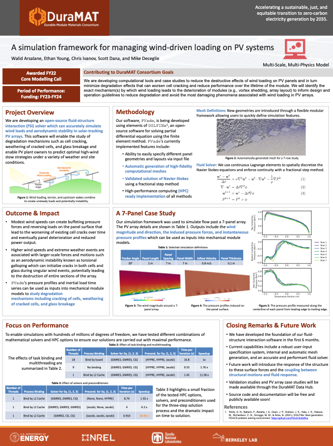
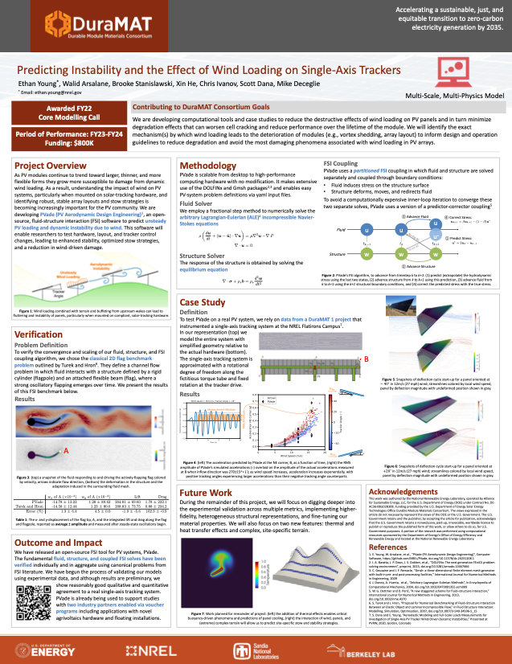
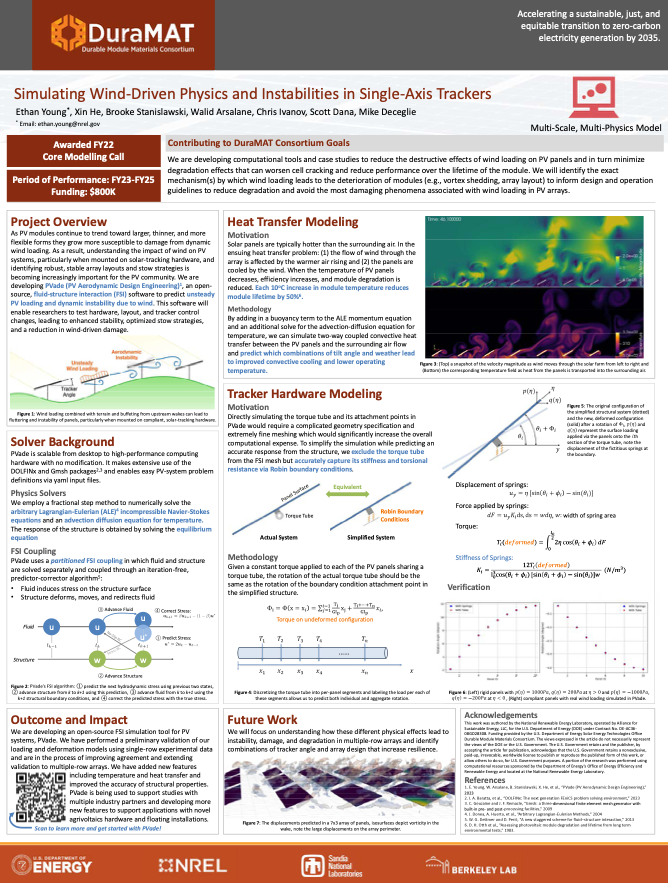
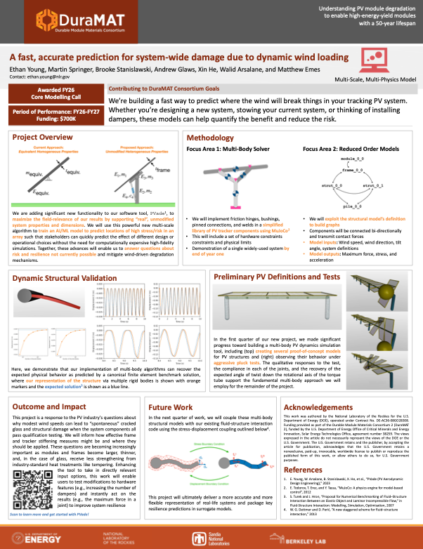

PVade Posters
=============

PVade has been presented as a poster at the Photovoltaics Reliability
Workshop (PVRW) each year as the project has evolved. The posters below are
provided as a record of that progress.

   PVRW 2023: A simulation framework for managing wind-driven loading on PV systems

   PVRW 2024: Predicting Instability and the Effect of Wind Loading on Single-Axis Trackers

   PVRW 2025: Simulating Wind-Driven Physics and Instabilities in Single-Axis Trackers

   PVRW 2026: A fast, accurate prediction for system-wide damage due to dynamic wind loading
